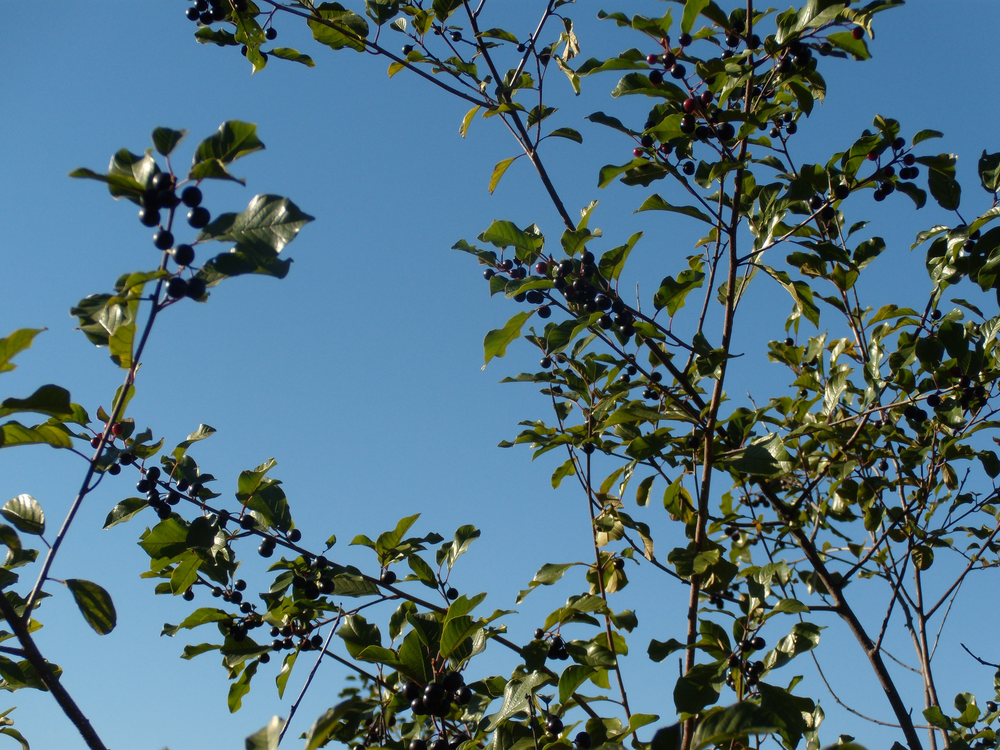

## Current research projects

These are projects that I am actively working on. 

### Parallel evolutionary radiations in *Protea* and *Pelargonium* in the Greater Cape Floristic Region

This project is funded by a grant from the NSF Dimensions of Biodiversity program, 
awarded to [Carl Schlichting](http://www.eeb.uconn.edu/people/schlichting/) and 
colleagues. The Greater Cape Floristic Region (GCFR) of South Africa is a region of
incredible plant diversity, much of which is the result of evolutionary radiations in
a relatively small number of lineages. The goal of this project is to investigate the
phylogenetic, taxonomic, and functional diversity of the GCFR by focusing on two 
radiations - that of the genus *Protea* and that of *Pelargonium*. As part of this project
we are also examining patterns of taxonomic and functional diversity of plant communities, 
as it is within these communities that radiations have occurred. More details on the 
project can be found at our [website](http://darwin.eeb.uconn.edu/wiki/index.php/Parallel_Evolutionary_radiations_in_Protea_and_Pelargonium_in_the_Greater_Cape_Floristic_Region). 
My role in this project is to lead the investigation of the relationships between 
plant communities, 
the functional traits of the plants that make up these communities, and the 
environmental conditions where these communities occur. Ultimately, we are trying to 
better understand what ecological and evolutionary processes drive the observed 
patterns of biodiversity in this region.

### The invasion of *Frangula alnus* in North America

Though the usefulness and value of distinguishing native and non-native species is 
currently a topic of lively debate, it is clear that some non-native species have 
substantial negative effects on biodiversity and human health. The seriousness of these 
threats justifies research into the ecological and evolutionary processes governing the 
establishment and spread of non-native species. Additionally, several researchers (e.g. 
Sax et al. 2007, Trends in Ecol. Evol. 22:465-471) have pointed out that studying species 
invasions may yield insights into ecological and evolutionary processes in general. With 
these two ideas in mind, I set out early in my graduate career to study a non-native 
species of concern in a geographic region and ecosystem of great importance to me, the 
deciduous forests of northeastern North America. Following discussions with researchers 
and land managers, I decided to focus my dissertation research on the non-native invasive 
species *Frangula alnus* (Glossy Buckthorn). 
For my Ph.D. research, I examined the temporal and 
spatial processes governing the invasion of *F. alnus* in a quantitative modeling 
framework that comprised (1) a demographic model based on data I am collecting during a 
multi-year field study; (2) a statistical model of the spread rate of *F. alnus* and the 
effects of land-use change, based on herbarium records and historical landscape 
reconstruction; and (3) a species distribution model (SDM), based on occurrence data from 
multiple sources. I integrated the results of these models, linking information on dynamic 
processes (e.g., results from the demographic model) with information on ecological 
patterns (e.g., results from the SDM), to gain an understanding of what processes 
contributed to the rapid spread of this species throughout northeast North America. 
This work 
is currently being prepared for publication. I am continuing to monitor the populations
I began monitoring in 2009 and am working to further refine our understanding of this
invasion, with the goal of applying what I have learned with *F. alnus* to other invasive
plants.

## Past research projects

These are project I worked on in the past.

### Effects of projected sea-level rise on shore birds

From 2009 to 2012 I worked with a collaborative research group that included scientists 
from the University of Florida and the Army Corp of Engineers to examine the effects of 
projected sea-level rise on shore-birds along the Gulf Coast of Florida.  My primary role 
in this project was to gather relavent biological information on three bird species of 
interest (Snowy Plover, Piping Plover, and Red Knot), and to construct a demographic model 
for the Snowy Plover (Charadrius nivosus). We linked this demographic model to a spatial 
model of the effect sea-level rise is projected to have on shore-bird habitat along the 
Gulf Coast, and examined what impacts on the risk of population decline and extinction 
such changes may have for this species.  Several publications have come out of this 
project, but my work on linking the demographic and spatial models was published late in 
2011 in Global Change Biology (Aiello-Lammens et al. 2011). (Image of Snowy Plover under 
Creative Commons Attribution 2.0 Generic from Wikipedia; photo by Mike Baird, 
bairdphotos.com)

### Causes of local extinction due to global climate change

Another project I have worked on is a systematic review of the proximate causes of local extinction due to climate change. This review was in part the result of a seminar lead by Professor John J. Wiens at Stony Brook University. The key question we set out to address in this review was "for observed local extinctions connected to climate change, are the proximate causes of extinction related to abiotic or biotic factors?" The results of our systematic review support the idea that biotic interactions are more often involved in the proximate cause of local extinction than abiotic factors (i.e. physiological limits). I have discussed our findings and my thoughts on the literature review process in 
[blog post](http://ecologistatwork.blogspot.com/2012/12/reviewing-causes-of-extinction-due-to.html)
at my previous blog site. The article, which I co-lead, can be found here 
[Cahill et al. 2012, Proceedings of the Royal Society B](http://rspb.royalsocietypublishing.org/content/early/2012/10/15/rspb.2012.1890).